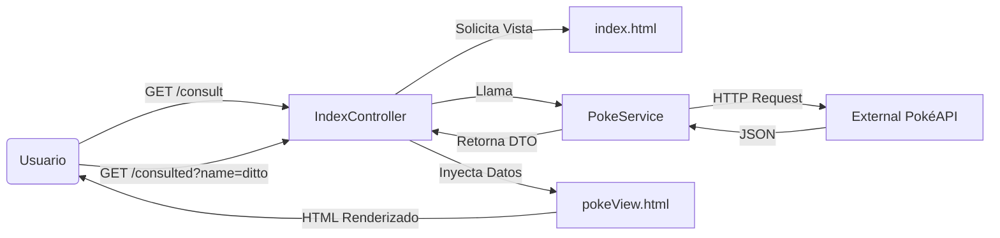

# PokeApiACM - Spring Boot Consumer

## Imagenes

## Descripción del Proyecto

**PokeApiACM** es una aplicación web desarrollada con **Spring Boot MVC** que actúa como cliente para consumir la [PokéAPI](https://pokeapi.co/).

El proyecto fue diseñado como una práctica para el grupo de trabajo **ACM WEBDEV**, demostrando cómo integrar servicios externos, mapear datos JSON complejos y presentarlos en una interfaz web utilizando renderizado del lado del servidor (SSR).

### Características Técnicas Destacadas

* **Cliente HTTP Moderno:** Implementación de `java.net.http.HttpClient` (nativo de Java 11+) configurado como Bean de Spring para realizar peticiones asíncronas y eficientes.
* **Java Records:** Uso de `record` para los DTOs (Data Transfer Objects), garantizando inmutabilidad y reduciendo el "boilerplate code".
* **Mapeo JSON:** Integración con **GSON** para la serialización y deserialización de datos externos.
* **Arquitectura Limpia:** Separación clara entre Modelos Internos (Lombok) y Modelos de API Externa (Records).
* **Frontend Integrado:** Vistas construidas con **Thymeleaf** para renderizado dinámico de atributos HTML.

## Stack Tecnológico

* **Lenguaje:** Java 17
* **Framework:** Spring Boot 3.3.4 (Starter Web, Thymeleaf)
* **Gestión de Datos:** Lombok, GSON 2.10
* **Build Tool:** Maven
* **Cliente API:** Java HttpClient (Standard Library)

## Arquitectura y Flujo

El proyecto sigue el patrón MVC (Modelo-Vista-Controlador):

Hecho con ❤️ por FoxTG
